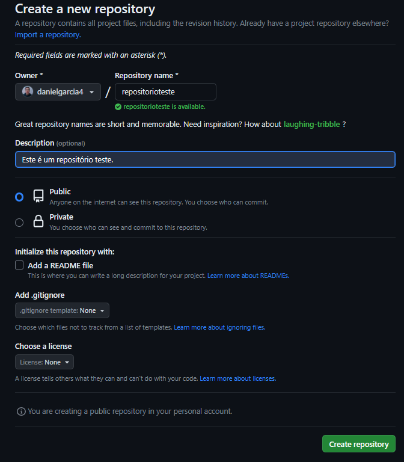
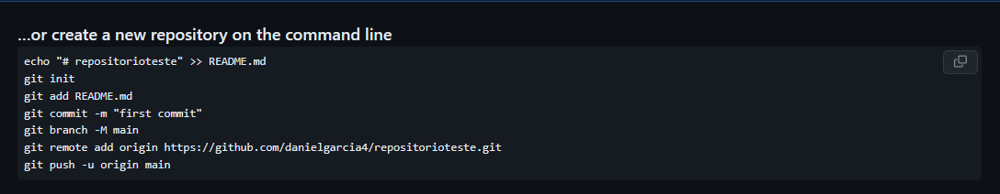
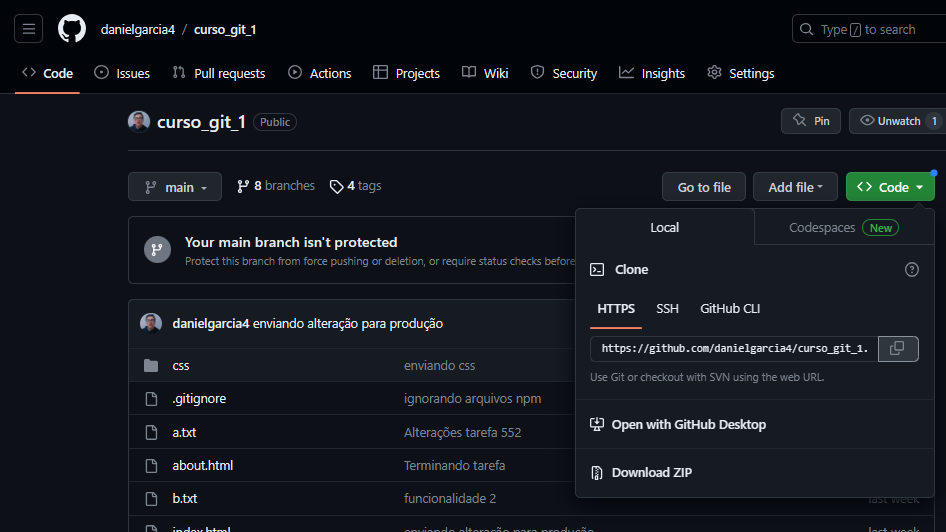

# Git e GitHub (Sprint 1)

## O que é Repositório? 

**Repositório** é onde o código será armazenado. O início do projeto se dá na criação do repositório. Existem servidores especializados em gerenciamento de repositórios, como o ***GitHub*** e o ***Bitbucket***. Com o auxílio desses servidores, os desenvolvedores do time podem baixar o repositório e criar versões diferentes em sua máquina.

Para **criar um repositório** utilizamos o comando: ``` git init ```

Com esse comando será criada a pasta oculta **.git**, que contém os arquivos necessários para a inicialização do repositório.

## O que é GitHub?

O **GitHub** (https://github.com) é um serviço para gerenciamento de repositórios que utiliza o sistema Git como base. Ele é gratuito e um dos mais utilizados no mundo. Nele, podemos enviar nossos projetos para o GitHub disponibilizando para outros desenvolvedores, tornando o projeto público ou privado.

Para, enviar os repositórios para o GH, basta seguir os seguintes passos:

1. **Criar o repositório no GitHub**



2. **Seguir os passos que aparecem na linha de comando**



### Comandos importantes

Para **verificar as mudanças do projeto**: ```git status```\
Com esse comando serão mapeadas todas as alterações do projeto, como arquivos não monitorados e arquivos modificados. Mostra a diferença do que já está enviado ao servidor ou salvo no projeto.

Para **adicionar arquivos** novos ao projeto: ```git add```\
Podemos adicionar arquivos específicos (```git add file```) ou todos de uma vez (```git add .```). Sempre que criar um arquivo novo devemos dar esse comando para que o arquivo seja reconhecido pelo controle de versão.

**Salvar alterações** do projeto: ```git commit```\
Com a flag ```-a``` podemos commitar arquivos específicos ou vários de uma vez.
Com a flag ```-m``` podemos enviar uma mensagem no commit, com as alterações que foram feitas;\
Exemplo: ```git commit -a -m “Hello world git”```


Para **enviar o código ao repo remoto**: ```git push```

Para **sincronizar o repositório local com as mudanças do remoto**: ```git pull```

Para **clonar repositório**: ```git clone https_do_git```\
O link para clonagem é obtido no GH, conforme a imagem abaixo



Para **remover arquivo** do repositório: ```git rm```\
Com esse comando o arquivo é removido da monitoração do git, logo ele não terá mais suas atualizações consideradas pelo git.

**Acessar histórico de modificações** (commits) feitas no projeto: ```git log```

Para **renomear arquivos**: ```git mv```\
**Exemplo:** ```git mv filename pastadestino/nomearquivo```

Para **retornar o arquivo ao estado original** (igual no repositório): ```git checkout```\
**Exemplo:** ```git checkout pasta/arquivo```

Para **ignorar arquivos**, basta criar um arquivo na raiz chamado ***.gitignore***. Os arquivos inseridos nele não entrarão no versionamento. Isso é muito útil para arquivos gerados automaticamente ou arquivos com informações sensíveis.

Para **resetar mudanças feitas**, sejam alterações commitadas ou pendentes: ```git reset```\
Geralmente é usado com a flag ```–hard```

## Atalhos
[Voltar para o README.md da raiz](/README.md)\
[Voltar para o README.md da Sprint 1](/Sprint%201/README.md)

