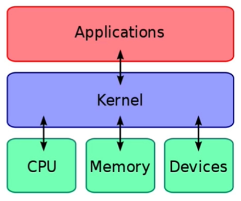

# Linux para desenvolvedores (Sprint 1)

## Teoria sobre Linux

* **Distribuição Linux**

**Distribuição do Linux** diz respeito às versões do Linux, diferentes umas das outras, derivadas umas das outras.

Definir a melhor distribuição não é uma tarefa fácil, já que cada distribuição é recomendada para uma determinada tarefa. As distribuições mais utilizadas em empresas são **Ubuntu** e **Debian**. O Ubuntu é fácil de configurar e aprender, sendo recomendado para iniciantes.

* **Kernel**

**Kernel** é considerado o coração do sistema. Ele é um software programado em *C* e em *Assembly* que faz comunicação com os hardwares do computador (CPU, memória, etc). Sendo assim, podemos dizer que o linux é dividido em três camadas: Aplicações, Kernel e Hardwares, e o Kernel é a ponte entre as Aplicações e Hardware, sendo a mais importante do sistema Linux, conforme demonstrado na figura abaixo (extraida dos slides do curso).

* **Vantagens do linux**

1. A maior parte das suas distribuições são free;
2. É utilizado na maioria dos servidores web
3. As grandes empresas utilizam como sistema operacional base (AWS, Heroku e diversas outras);
4. É requisito para muitas vagas de emprego;
5. Comunidade muito ativa, tornando mais fácil resolver problemas;
6. Os servidores mais seguros são Linux;
7. Suporte nativo para muitas linguagens;

## Atalhos
[Voltar para o README.md da raiz](/README.md)\
[Voltar para o README.md da Sprint 1](/Sprint%201/README.md)