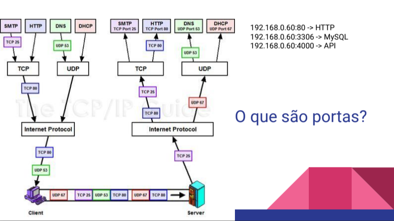

# Linux para desenvolvedores (Sprint 1)

## Gerenciamento básico de redes

**Redes** são os conjuntos de dispositivos de computação interligados por um sistema. A web, por exemplo, é uma rede.

A **web** funciona da seguinte forma: Ao digitar um endereço na internet, acontecem os seguintes passos:

1. Envio de requisição para um domínio (DNS)
2. Verificação do domínio (DNS = IP)
3. Requisição da resposta para o servidor que pertence a este domínio
4. Retorno da resposta a quem solicitou


### DNS

**DNS (*Domain Name System*)** é o nome do **IP**, ou seja, traduz o endereço de IP em um domínio.

Alguém digita um domínio no navegador. Um servidor lê o DNS digitado, encontra o servidor pela combinação de DNS e IP e retorna ao usuário o site desejado.


### Portas

**Porta** é um ***endpoint***, e está sempre associada a um IP. Ou seja, é o local virtual do sistema onde são estabelecidas as conexões, contendo o endereço necessário para que as informações cheguem aos usuários corretos. 

**Exemplos de portas:**\
20: FTP\
22: SSH\
80: HTTP\
443: HTTPS



### TCP

**TCP (*Transmission Control Protocol*)** é um protocolo utilizado para a transmissão de dados pela rede, contendo sistemas que priorizam a segurança dos dados. Alguns protocolos que utilizam TCP: **SMTP** (Envio de e-mails); **FTP**(transferência de arquivos); **HTTP** (protocolo para navegar na internet).

### UDP

Já **UDP (*Datagram Protocol*)** também é para o envio de dados, se preocupando mais com a velocidade do envio do que a confiabilidade. Esse protocolo é utilizado principalmente para jogos online. 

### Alguns comandos de redes

* ```ping```: serve para testar a conectividade. Em DNS verifica se está conectado a internet, se há perda de pacotes, se há permissão de acessar determinados sites e verifica se um DNS existe. Também é possível fazer em IPs.\
**Testando o ping:** ```ping google.com```


* ```netstat``` - networking statistics: serve para ver com o que nosso computador está se comunicando. Conseguimos ver quais conexões TCP e UTP estão abertas, sejam internas ou externas.
Para utilizar esse comando, é necessário instalar o pacote (```sudo apt-get install net-tools```)

* ```netstat - a``` (mostra todas as conexões ativas)

* ```netstat -at``` (mostra todas as conexões tcp ativas)

* ```netstat -au``` (mostra todas as conexões udp ativas)

* ```ifconfig``` - interface configuration:
É usado para ver ou mudar as configurações de redes que temos em nosso sistema\
**código:** ```ifconfig -a```

* ```nslookup``` - serve para saber os ips através do DNS\
**exemplo:** ```nslookup google.com```

* ```tcpdum``` - consegue ver todas os pacotes tcp que vem para nossa máquina.

**Dica:** ```hostname -I``` (para ver o ip da própria máquina)
