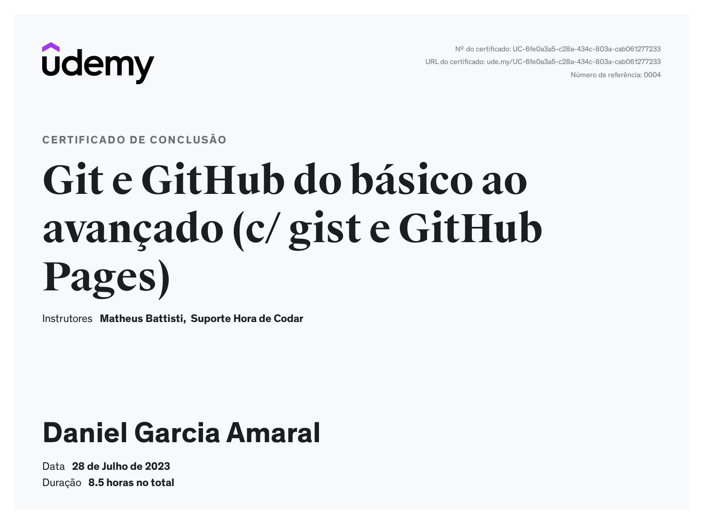
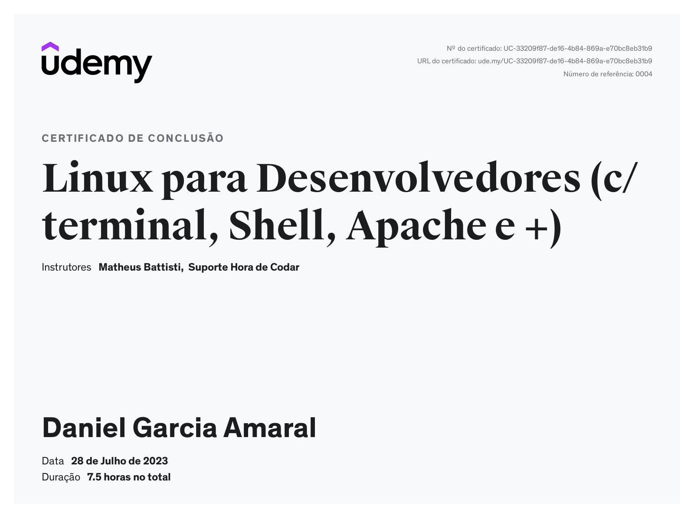

# Sprint 1

## Git e GitHub

No curso de **Git e GitHub do básico ao avançado** foram abordados desde conceitos básicos até comandos mais avançados de *Git* e *GitHub*, com uma abordagem prática para controle de versão e gerenciamento de repositórios.\
Os tópicos abordados foram:

1. [**O que é Git?**](/Sprint%201/1_Git%20e%20GitHub/1_intro.md)
2. [**Git Fundamental**](/Sprint%201/1_Git%20e%20GitHub/2_git_fundamental.md)
3. [**Branches**](/Sprint%201/1_Git%20e%20GitHub/3_branches.md)
4. [**Compatilhamento e atualizações de repositórios**](/Sprint%201/1_Git%20e%20GitHub/4_compartilhamento_repo.md)
5. [**Análise e inspeção de repositórios**](/Sprint%201/1_Git%20e%20GitHub/5_analise_repo.md)
6. [**Administração de repositórios**](/Sprint%201/1_Git%20e%20GitHub/6_admin_repo.md)
7. [**Melhorando commits do projeto**](/Sprint%201/1_Git%20e%20GitHub/7_melhorando_commits.md)
8. [**Explorando e entendendo o GitHub**](/Sprint%201/1_Git%20e%20GitHub/8_explorando_gb.md)
9. [**Markdown do básico ao avançado**](/Sprint%201/1_Git%20e%20GitHub/9_markdown.md)

Para acessar os resumos e códigos relacionados, basta clicar nos links da lista acima.

## Linux para desenvolvedores

No curso **Linux para desenvolvedores** aprendemos sobre os sistemas operacionais baseados em Linux, com os princípios básicos de operação e comandos de terminal. A distribuição Linux que utilizamos é o **Ubuntu**.\
Os tópicos abordados foram:

1. [**Teoria sobre Linux (distribuição, kernel)**](/Sprint%201/2_Linux%20para%20desenvolvedores/1_teoria.md)
2. [**Linux Fundamental**](/Sprint%201/2_Linux%20para%20desenvolvedores/2_linux_fundamental.md)
3. [**Gerenciamento de diretórios e arquivos**](/Sprint%201/2_Linux%20para%20desenvolvedores/3_gerenciamento_diretorios.md)
4. [**Gerenciamento de pacotes/aplicativos**](/Sprint%201/2_Linux%20para%20desenvolvedores/4_gerenciamento_pacotes.md)
5. [**Filtro e buscas em arquivos e diretórios**](/Sprint%201/2_Linux%20para%20desenvolvedores/5_filtros.md)
6. [**Editores de texto mais utilizados**](/Sprint%201/2_Linux%20para%20desenvolvedores/6_editores.md)
7. [**Gerenciamento de usuários e grupos**](/Sprint%201/2_Linux%20para%20desenvolvedores/7_gerenciamento_usuários.md)
8. [**Gerenciamento de permissões**](/Sprint%201/2_Linux%20para%20desenvolvedores/8_gerenciamento_permissoes.md)
9. [**Gerenciamento básico de redes**](/Sprint%201/2_Linux%20para%20desenvolvedores/9_redes.md)
10. [**Compactação e descompactação de arquivos e diretórios**](/Sprint%201/2_Linux%20para%20desenvolvedores/10_compactar_arquivos.md)

Para acessar os resumos e códigos relacionados, basta clicar nos links da lista acima.

## Certificados

* **Certificado de conclusão do curso de *Git e GitHub do básico ao avançado*** 

* **Certificado e conclusão do curso de *Linux para desenvolvedores***

## Atalhos
[Voltar para o README.md da raiz](/README.md)