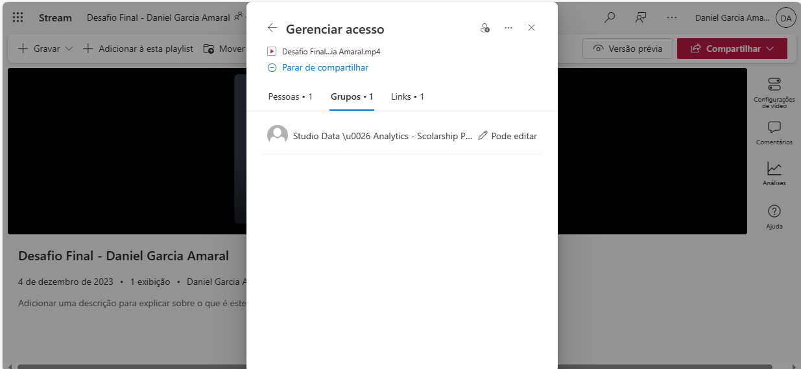
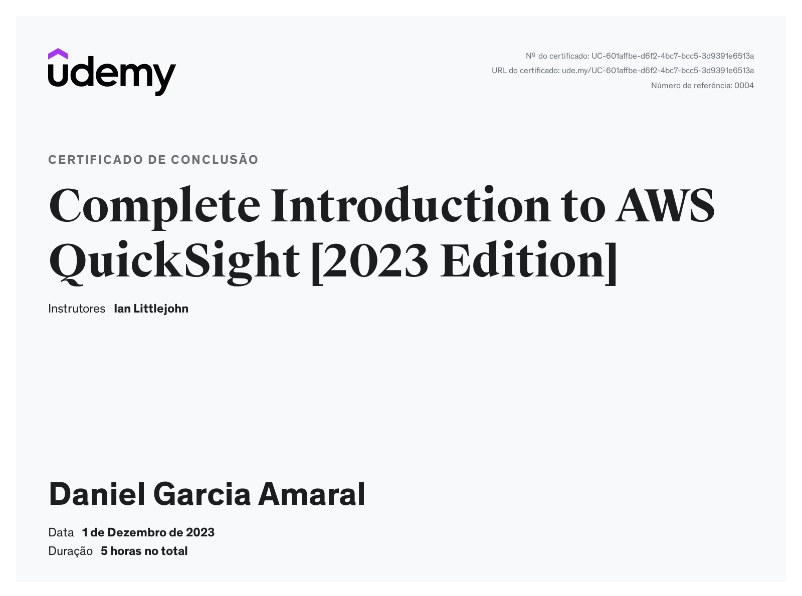

# Sprint 10

Organizar os dados de modo a potencializar seu consumo a todos os interessados corresponde a construção das fundações de um Data Lake. Todavia, o valor dos dados somente é evidenciado quanto torna-se informação e conhecimento a disposição da tomada de decisão. É neste ponto que a análise e a visualização de dados tornam-se disciplinas essenciais ao sucesso do projeto.

Nessa sprint fizemos um dashboard no QuickSight, utilizando os dados que viemos transformando ao longo das sprints, para gerar insights.

## Dashboard

Para o conjunto de dados foi usado o datasource Athena no QuickSight.

Os filmes tem uma grande diversidade de características, entre elas a duração. Alguns filmes são rapidinhos, que você assiste como se fosse o episódio de uma série. Já outros, são mais longos, com duração de duas horas e meia, três horas e muito mais. E muitas vezes um filme muito curto acaba não sendo tão detalhado, mas as vezes um filme longo acaba sendo cansativo. Isso me levou à seguinte indagação: “Existe alguma relação entre a duração dos filmes e sua popularidade?”

Por isso decidi pelo tema **“Análise comparativa entre o tempo de duração e a popularidade dos filmes dos gêneros Sci-Fi e Fantasy: existe alguma relação?”**.

O dashboard montado ficou assim:

A partir da análise desse dashboard e a extração de insights:

* Não existe uma influência direta do tempo de duração na popularidade do filme;
* Para análises futuras: fazer o paralelo de outros fatores com a popularidade para identificar alguma influência.

## Apresentação do Desafio Final

Fiz a entrega do vídeo de apresentação do desafio final no Stream, compartilhando com o usuário studio.dataanalystics.scholarshipprogram, como solicitado.

## Certificados

* Complete Introduction to AWS QuickSight [2023 Edition]

* Data & Analytics - PB - AWS 10/10

