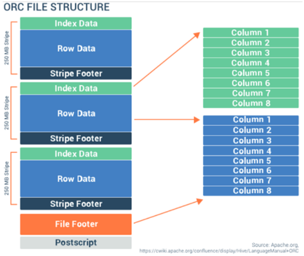

## Big Data

É um grande volume de dados que exigem formas inovadoras e econômicas de processamento de informações que melhoram a percepção, tomada de decisão e automação de processos. De acordo com as definições de Doug Laney, existem 5 Vs importantes, sendo eles:
 
* **Volume:** será necessário processar grandes volumes de dados estruturados ou não.

* **Velocidade:** os dados são recebidos em grande velocidade e precisam ser processados a altura.

* **Variedade:** existem diversos tipos de dados, sejam eles estruturados, semi estruturados ou não estruturados.

* **Variabilidade:** os fluxos de dados podem ser altamente inconsistentes com picos periódicos, dificultando o gerenciamento e manipulação dos dados.

* **Complexidade:** os dados têm origem em múltiplas tecnologias. É preciso conectar e correlacionar relações, hierarquias e ligações múltiplas para não perder o controle sobre esses dados.

## Ciência de dados

É uma área interdisciplinar voltada para o estudo e a análise de dados, estruturados ou não, que tem como objetivo a extração de conhecimento ou percepção para tomadas de decisão. Dá utilidade para os grandes volumes de dados. As principais áreas envolvidas são: Ciência da Computação, Matemática e Estatística, Especialização Científica, Pesquisa, Software e Aprendizado de Máquina.

## Diferenças entre papéis envolvidos em BigData:

**Desenvolvedor:** focado em problemas técnicos e no gerenciamento dos dados. (Ciência de Computação, Engenharia de Computação, etc)

**Estatístico:** focados em problemas estatísticos (mestres/doutores)

***Businessperson:*** focados na empresa e na geração de lucros dos projetos de dados. (Engenheiros de Dados, Arquitetos de Soluções, Desenvolvedores)

## Tipos de dados

**Literal:** Dados literais: nome, idade, e-mail, endereço, telefone etc. Depois que os dados forem cadastrados, eles serão armazenados de forma inter-relacionada, e assim os dados brutos transformam-se em dados processados. Por exemplo, **informações** de uma pessoa. Quando os dados são processados, eles passam a representar informações.

**Dado:** menor partícula de uma informação, como um caractere, um texto, número, áudio, foto, vídeo, arquivo, etc.

**Informação:** são dados processados que apresentam um sentido.

**Conhecimento e Inteligência:** Os dados correspondem ao nível mais baixo, depois de processados ou interpretados tem-se a informação e, então, quando ela é
contextualizada, chega-se ao **conhecimento**. O conhecimento é transformado em **inteligência** pelo processo do aprendizado ou aplicação e avaliação dos conhecimentos, servindo como importante ferramenta para tomada de decisões.

## Dados Estruturados e Não Estruturados

**Dados Estruturados:** são aqueles organizados e representados com uma estrutura rígida, a qual foi previamente planejada para armazená-los. Os dados estruturados de um mesmo bloco possuem uma **relação**, e mesmo que possuam diferentes valores, possuem os mesmos **atributos** e **formatos**. Então podemos dizer que banco de dados é um exemplo de dados estruturados.

**Dados não estruturados:** são aqueles que tem uma estrutura flexível e dinâmica ou **sem estrutura definida**, como arquivos, textos, imagens, vídeos etc, ou seja, a maior parte do conteúdo digital gerado no mundo.

**Dados semi estruturados:** são dados que possuem estrutura mas ela é flexível, com uma representação heterogênea. Cada campo de dado tem uma estrutura, mas não existe uma imposição de formato. Alguns exemplos são arquivos XML, JSON etc.

**Banco de dados:** É uma coleção organizada de dados, geralmente armazenados e acessados eletronicamente de um sistema de computador, que se relacionam de forma a criar algum sentido e dar mais eficiência em uma pesquisa ou estudo. O Sistema de Gerenciamento de Banco de Dados (**SGBD**) é o software que interage com usuários finais, aplicativos e com o próprio banco de dados para capturar e analisar os dados.

## Banco de Dados Relacionais

Utilizam o modelo relacional de dados, que contém:

* **Tabelas:** estrutura de linhas e colunas para armazenamento de dados.

* **Colunas (atributos):** são as características dos dados armazenados, como nome, data de nascimento, etc

* **Registros (tuplas):** é uma linha formada por uma ou mais colunas

* **Chaves:** fazem o relacionamento entre as tabelas. **Chave Primária** é o identificador exclusivo de uma tabela. **Chave estrangeira** é a chave de relação entre uma tabela e outra.

SGBDs relacionais respeitam as propriedades de transação **ACID**:

**Atomicidade:** garante que uma transação é realizada por completo ou não é realizada. Não existe transação parcial;

**Consistência:** garante que somente dados válidos são armazenados de acordo com as regras pré-definidas no banco de dados;

**Isolamento:** garante a proteção de que o dado de uma transação não afeta o dado de outra transação;

**Durabilidade:** garante que todos salvos não sejam perdidos.

Existem 2 tipos de arquitetura:

**OLAP (Processamento Analítico em Tempo Real):** otimizado para realização de seleção/extração de dados ou de grande volume de dados. Ideal para sistemas como de DW.

**OLTP (Processamento de Transações em Tempo Real):** otimizado para registrar transações. Ideal para sistemas com interações com clientes ou sistemas transacionais.

A linguagem predominante no banco de dados é **SQL**.

## Banco de dados NoSQL

**Banco de dados chave-valor (*key-value*)**: usa chaves para armazenar valor. Valores podem ser objetos binários simples que vão de textos planos (simples strings) até vídeos. Exemplos: *Redis*, *Amazon DynamoDB*, *Memcached* e *CosmosDB*;

**Banco de dados Orientado a Documentos:** similar ao *key-value*, exceto que o valor é um únicp documento, normalmente um XML, JSON ou BSON. Exemplos: *MongoDB*, *CouchBase*, *Amazon DynamoDB* e *CosmosDB*;

**Banco de dados Orientado a Colunas:** similar ao *key-value*, porém armazena coluna e valor. Exemplos: *HBase*, *Cassandra* e *CosmosDB*;

**Banco de dados Orientado a Grafos:** usa estruturas de grafos para armazenar, mapear e relacionar dados. Bancos de grafos não tem tabelas e colunas, tem sim nodos, vertices e relações. Levam vantagem em mineração de dados e reconhecimento de padrões. Exemplos: *Neo4j*, *CosmosDB* e *OrientDB*.

## Tipos de armazenamento de dados

Os formatos mais utilizados para armazenar dados são TXT, CSV, XML, JSON, ORC, PARQUET e AVRO.

**TXT:** Arquivos com a extensão .txt  podem ser facilmente lidos ou abertos por qualquer programa que lê texto e, por essa razão, são considerados universais (ou plataforma independente). Estes arquivos são facilmente editáveis, bastando alterar o que está escrito, com um simples delete seguido de nova escrita.

**CVS:** O Comma-Separated Values é um arquivo de texto delimitado que usa uma vírgula ou outro tipo de delimitador (como ponto e vírgula) para separar valores.

**XML:** Extensible Markup Language é um formato para a criação de documentos com dados organizados de forma hierárquica, frequentemente, em documentos de texto formatados, imagens vetoriais ou bancos de dados.

**JSON:** O JavaScript Object Notation é um formato compacto, de padrão aberto independente, de troca de dados simples e rápida (parsing) entre sistemas, que utiliza texto legível a humanos, no formato atributo-valor (natureza auto-descritiva). Isto é, um modelo de transmissão de informações no formato texto, muito usado em web services que usa transferência de estado representacional (REST) e aplicações AJAX, substituindo o uso do XML.

**AVRO:** O Apache Avro é um formato baseado em linha que é altamente divisível. O recurso inovador e essencial do Avro é que o esquema viaja junto com os dados. A definição de dados (metadados) é armazenada no formato JSON enquanto os dados são
armazenados no formato binário, minimizando o tamanho do arquivo e maximizando a eficiência.

**PARQUET:** Foi desenvolvido pela Cloudera e pelo Twitter (e inspirado no sistema de consultas Dremel do Google) para servir como um armazenamento de dados colunares otimizado para o Hadoop. Como os dados são armazenados por colunas, eles podem ser altamente compactados e divididos.

**ORC:** O Optimized Row Columnar foi desenvolvido pela primeira vez na Hortonworks para otimizar o armazenamento e o desempenho no Apache Hive, resumidamente um data warehouse para consultas e análises no Hadoop. O Hive foi projetado para consultas e análises e usa a linguagem de consulta HiveQL (semelhante ao SQL). Os arquivos ORC são projetados para alto desempenho quando o Hive está lendo, gravando e processando dados. O ORC armazena dados em linha no formato colunar. Esse formato de coluna de linha é altamente eficiente para compactação e armazenamento. Ele permite o processamento paralelo num cluster, e o formato colunar permite pular colunas desnecessárias para um processamento e descompressão mais rápidos. A seguir está representado estrutura ORC.

## Data Lake

Um **Data Lake** é um local central para armazenar todos os seus dados, independentemente de sua origem ou formato. Data Lakes são alimentados com informações em sua forma nativa com pouco ou nenhum processamento realizado para adaptar a estrutura a um esquema corporativo. A estrutura dos dados coletados, portanto, não é conhecida quando é inserida no Data Lake, mas é encontrada somente por meio da descoberta, quando lida. Por isso, uma grande vantagem de um Data Lake é a flexibilidade.

## Arquitetura Lambda

Este modelo independe de soluções tecnológicas específicas para a ingestão, armazenamento e processamento dos dados, ou seja, é um modelo teórico.\ 
Para que os dados sejam processados e entregues atingindo uma expectativa de tempo dos stakeholders, a arquitetura Lambda é dividida em três camadas: ***batch layer***, ***speed layer*** e ***serving layer*** de acordo com a figura abaixo:

Dentro da ***batch layer*** esse dado é armazenado de maneira atômica, ou seja, nada é atualizado ou sobrescrito.

Como a quantidade de dados armazenados a cada dia só cresce, e os dados da ***serving layer*** só são recebidos ao final do processamento da ***batch layer***, o resultado é que cada vez o intervalo para a atualização no ***serving layer*** fica maior.

Visando compensar esse intervalo a ***speed layer*** foi criada, essa camada, que recebe a mesma estrutura atômica de dados, irá processá-los em tempo real e disponibilizá-los para que os sistemas finais disponham dessas informações enquanto esperam pela ***batch layer***.

Utilizando as três camadas dessa arquitetura é possível processar uma quantidade imensa de dados e mantê-los em sua estrutura original na ***batch layer***, disponibilizar esses dados em visualizações pré-computadas (***serving layer***), compensar os intervalos da camada batch e continuar entregando as informações em tempo real (***speed layer***).

## Atalhos
[Voltar para o README.md da raiz](/README.md)
