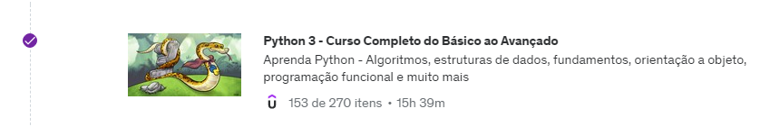
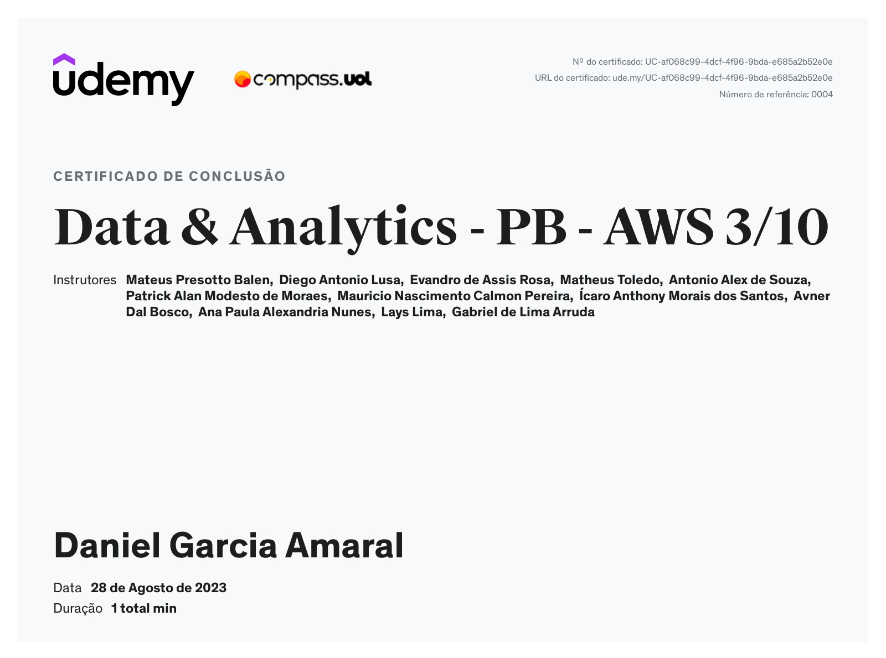

# Sprint 3

## Python 3 - Curso Completo do Básico ao Avançado

Na parte selecionada desse curso para essa sprint aprendemos python: algoritmos, estruturas de dados, fundamentos, orientação a objeto, programação funcional e muito mais.

Alguns tópicos abordados foram:

* Introdução Python (O que é, Filosofia, PEP 8, Algoritmo, Estrutura de Dados, etc)
* Configuração do ambiente
* Fundamentos de Python (Tipos básicos, Variáveis, Comentários, Operadores, Conversão de tipos, Números, Strins, Listas, Tuplas, Dicionários, Conjuntos, etc)
* Estruturas de controle (if, else, while, for, break/continue, switch, match - case, etc)
* Manipulação de Arquivos
* Comprehension
* Funções
* Pacotes
* Programação Orientada a Objetos
* Gerenciamento de pacotes
* Isolamento de Ambiente

## Exercícios

1. [Exercícios de Python - 1 ao 25](./exercicios)
2. [Desafio - ETL com Python](./desafio/)

## Material de Estudo

* [Apostila do Curso](./material/curso-python-versao-1.1.pdf)
* [Material de Estudo - Mód 1](./material/DA++-+Linguagem+Python++-+Módulo+I.pdf)
* [Material de Estudo - Mód 2](./material/DA++-+Linguagem+Python++-+Módulo+II.pdf)

## Certificados

* **Python 3 - Curso Completo do Básico ao Avançado**

* **Data & Analytics - PB - AWS 3/10**

## Atalhos
[Voltar para o README.md da raiz](/README.md)