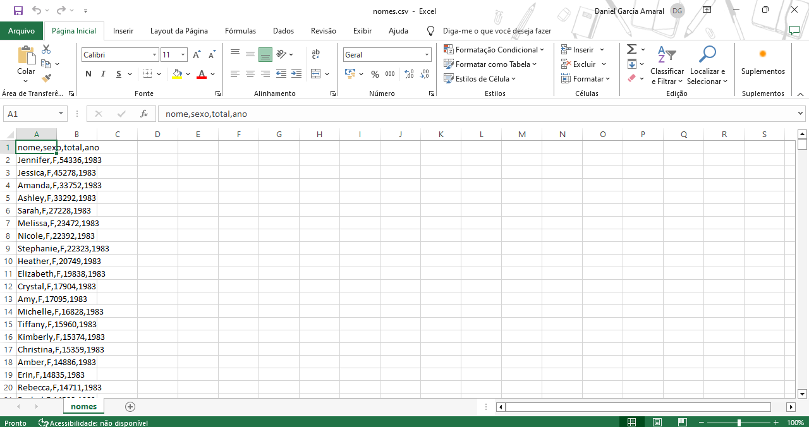
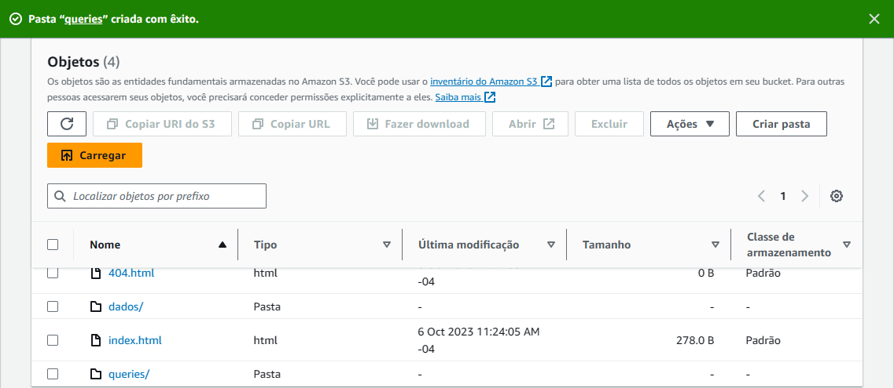
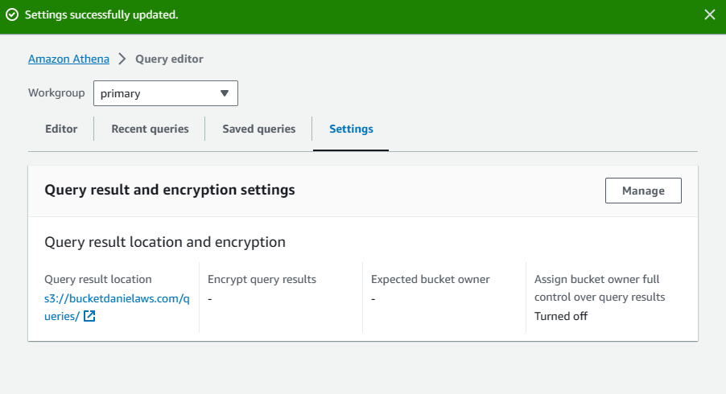
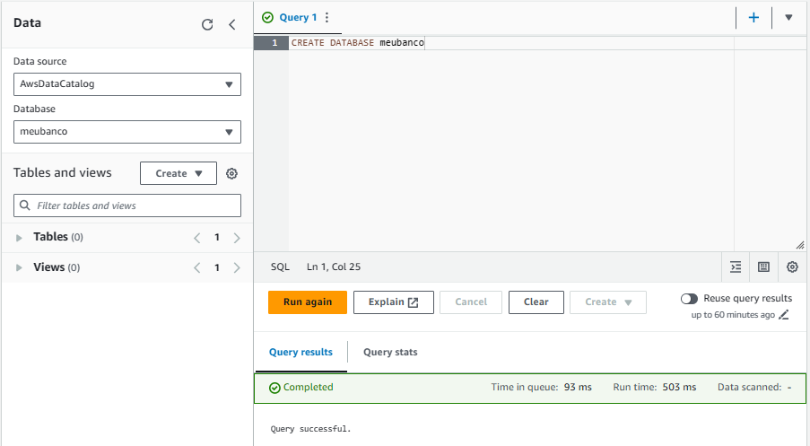
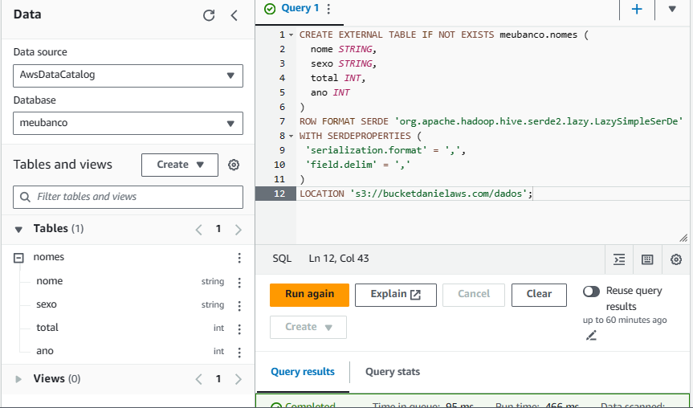
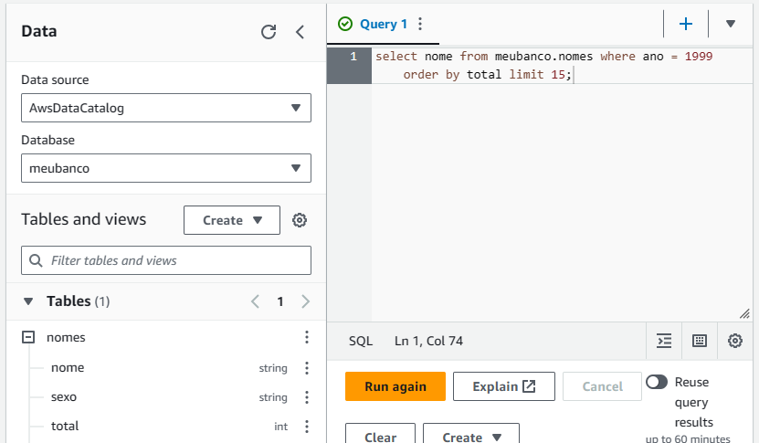
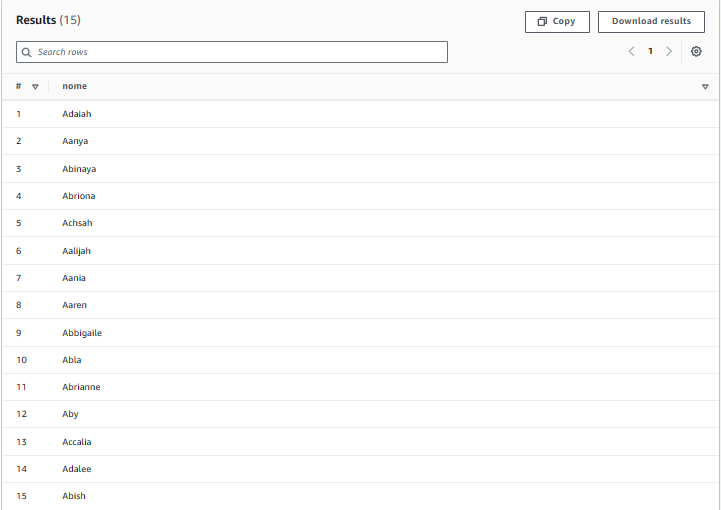
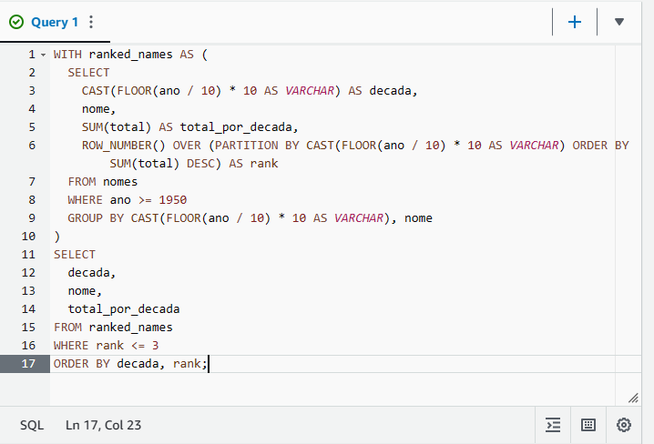
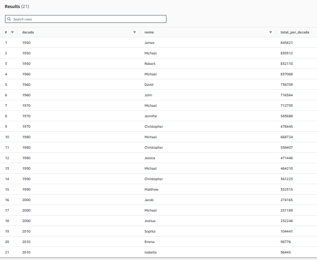

# Lab AWS Athena

### Etapa 1: Configurar Athena

* Análise do arquivo *nomes.csv*.

Nome e tipo de dado das colunas:

nome STRING,\
sexo STRING,\
total INT,\
ano INT

* Criação da pasta *queries*.

* Configuração do local para os resultados de consultas no Amazon S3.

### Etapa 2: Criar um banco de dados

* Criação do banco de dados *meubanco*.

### Etapa 3: Criar uma tabela

* Elaboração da *query* para a criação da tabela e execução.

* Teste dos dados com a query apresentada.

* Criação da consulta que lista os 3 nomes mais usados em cada década desde o 1950 até hoje.

