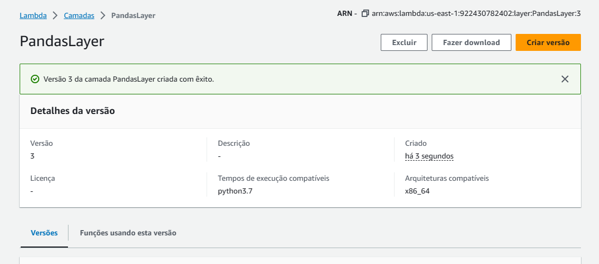
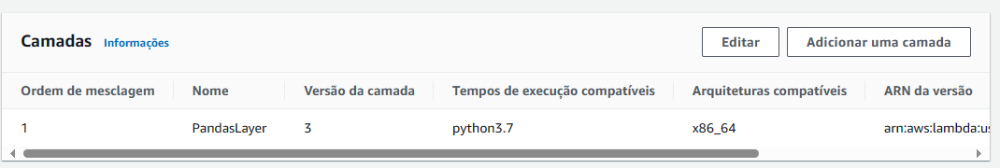

# Lab AWS Lambda

### Etapa 1: Criar a função do Lambda


### Etapa 2: Construir o código

* Alterando o *lambda_function.py*


* Teste da Lambda com mensagem de erro


### Etapa3: Criar uma Layer

* Criação do Dockerfile e da imagem do Docker


* Criação das pastas


* Baixar bibliotecas e dependências


* Compactando os arquivos em um arquivo chamado *minha-camada-pandas.zip*

```
bash-4.2# cd ..
bash-4.2# zip -r minha-camada-pandas.zip .
```


* Copiar o arquivo para a máquina local


* Carregando o arquivo para o bucket S3


* Criação da camada



### Etapa 4: Utilizando a Layer

* Camada adicionada



* Execução do teste com erro ainda


* Aumentando o tempo limite e o tamanho da memória da Lambda.


* Execução bem sucedida.


