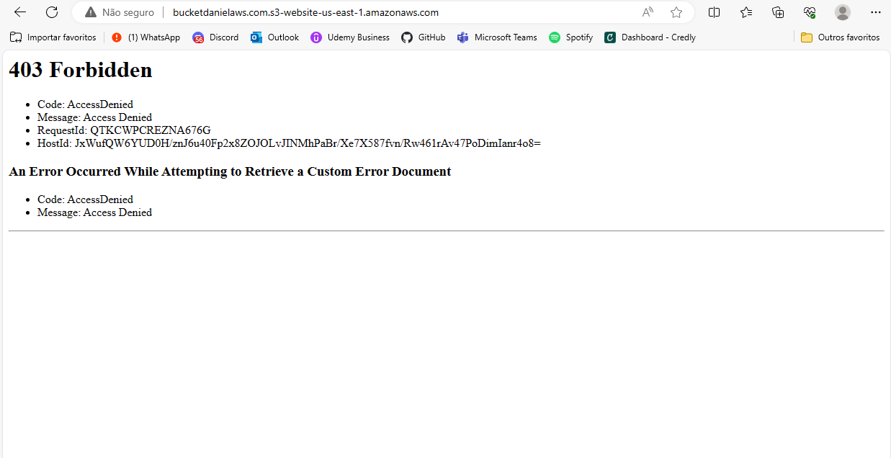

# Lab AWS S3

## Objetivo

Explorar as capacidades do serviço AWS S3.  Nos passos que seguem, você será guiado pelas configurações necessárias para que um bucket do Amazon S3 funcione como hospedagem de conteúdo estático.

## Evidências

### Etapa 1: Criar um bucket

### Etapa 2: Habilitar hospedagem de site estático

* Hospedagem de site estático habilitada

* Endpoint

### Etapa 3: editar as configurações do Bloqueio de acesso público

* Opção "Bloquear todo acesso público" desativada

### Etapa 4: Adicionar política de bucket que torna o conteúdo do bucket publicamente disponível

* Política do bucket editada

### Etapa 5: Configurar um documento de índice

* Criando um arquivo local com o nome *index.html*.

* Upload do index.html e do dados/nomes.csv para o bucket.

### Etapa 6: configurar documento de erros

* Upload do documento de erros *404.png* no bucket

### Etapa 7: testar o endpoint do site

* Teste do endpoint do site no navegador

