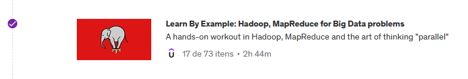
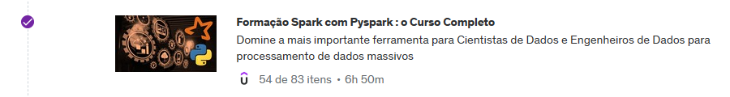

# Sprint 7

Nessa sprint aprofundamos nosso conhecimento sobre aquele que é, provavelmente, o framework de processamento de dados mais utilizado no mercado atualmente: Apache Spark. Tivemos uma introdução ao seu funcionamento, com laboratórios práticos, e iniciamos a primeira etapa do projeto final.

## Exercícios

Clique nos links para acessar as resoluções das atividades.

* [Tarefa 1: Python com Pandas e Numpy](./Tarefa1/README.md)

* [Tarefa 2: Apache Spark - Contador de Palavras](./Tarefa%202/README.md)

* [Lab AWS Glue](./lab-glue/README.md)

* [Desafio Parte 1 - ETL](./desafio1/README.md)

## Certificados

* Learn By Example: Hadoop, MapReduce for Big Data problems

* Formação Spark com Pyspark : o Curso Completo

* Data & Analytics - PB - AWS 7/10

