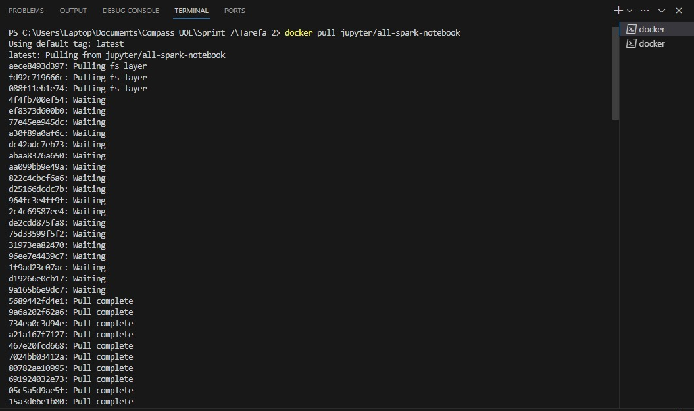
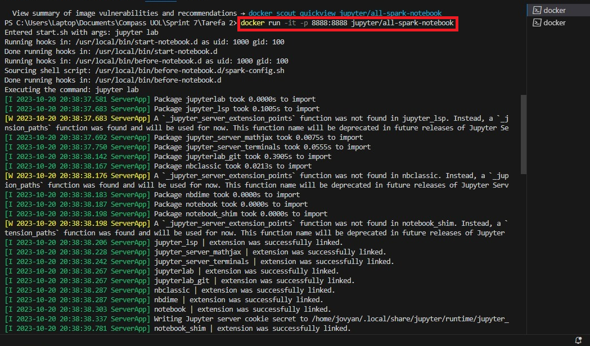
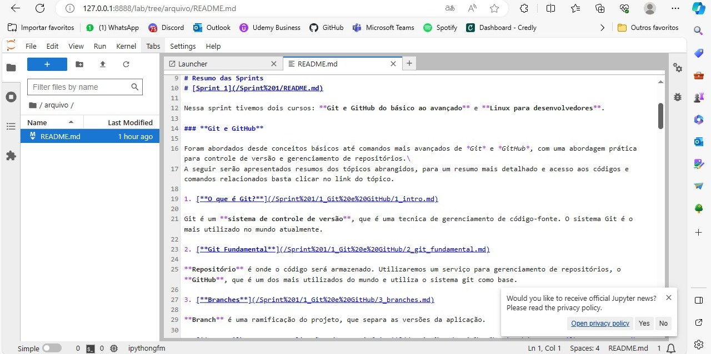
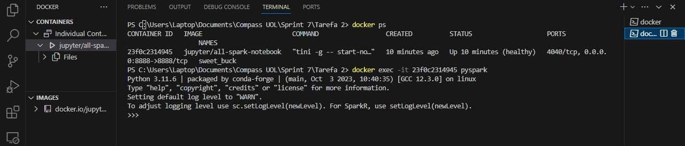
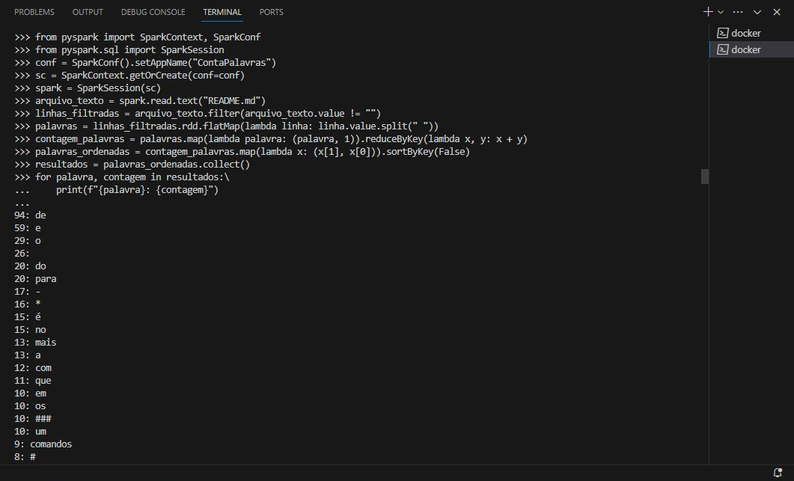

# Sprint 7

## Tarefa 2

### 1. Usando o Spark Shell, apresente a sequência de comandos Spark necessários para contar a quantidade de ocorrências de cada palavra contida no arquivo README.md de seu repositório git.
#### 1 - Realizar o pull da imagem jupyter/all-spark-notebook



#### 2 - Criar um container a partir da imagem



* Upload do README.md no Jupyter



**OBSERVAÇÃO:**  Depois movi o README.md para a raiz do Jupyter de apaguei a pasta /arquivo que havia criado para armazenar o arquivo. Logo, o README.md se encontra no caminho: *127.0.0.1:8888/lab/tree/README.md*. Infelizmente perdi o print, por isso essa observação.

O README.md usado se encontra na pasta arquivo desse diretório. [Clique aqui para acessar](./arquivo/README.md)

#### 3 - Em outro terminal, execute o comando `pyspark` no seu container. Pesquise sobre o comando  docker exec para realizar esta ação. Utilize as flags -i e -t no comando.



### 2. Usando o Spark Shell, apresente a sequência de comandos Spark necessários para contar a quantidade de ocorrências de cada palavra contida no arquivo README.md de seu repositório git.



``` python
# Importar as bibliotecas necessárias
from pyspark import SparkContext, SparkConf
from pyspark.sql import SparkSession

# Configurar o Spark
conf = SparkConf().setAppName("ContaPalavras")
sc = SparkContext.getOrCreate(conf=conf)  
spark = SparkSession(sc)

# Ler o arquivo README.md no diretório raiz do Jupyter
arquivo_texto = spark.read.text("README.md")

# Eliminar linhas em branco e dividir o texto em palavras
linhas_filtradas = arquivo_texto.filter(arquivo_texto.value != "")
palavras = linhas_filtradas.rdd.flatMap(lambda linha: linha.value.split(" "))

# Contagem das palavras
contagem_palavras = palavras.map(lambda palavra: (palavra, 1)).reduceByKey(lambda x, y: x + y)

# Ordenar as palavras pela contagem em ordem decrescente
palavras_ordenadas = contagem_palavras.map(lambda x: (x[1], x[0])).sortByKey(False)

# Coletar os resultados em uma lista
resultados = palavras_ordenadas.collect()

# Imprimir o resultado com um bloco 'for'
for palavra, contagem in resultados:
    print(f"{palavra}: {contagem}")

```
