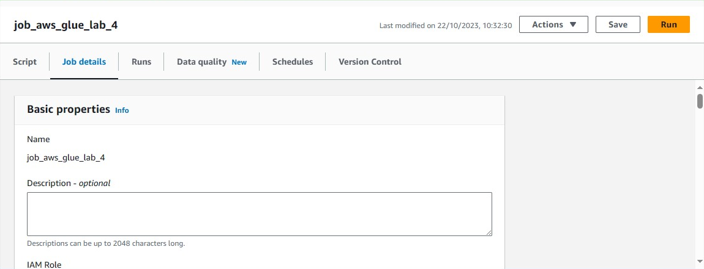
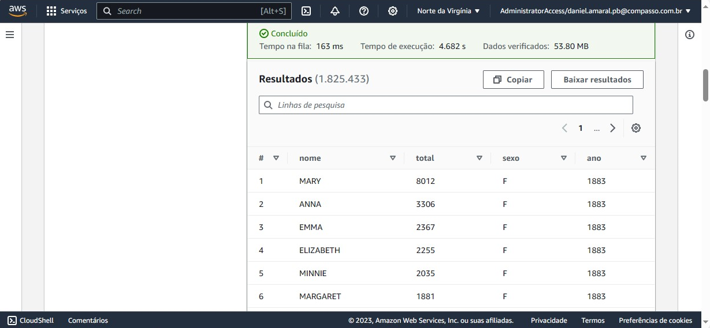

# Sprint 7

## Lab AWS Glue

### 1 - Preparando os dados de origem

* *nomes.csv* armazenado no bucket S3


### 2 - Configurando sua conta para utilizar o AWS Glue

* Usuário IAM criado


* Regras do *AWSGlueServiceRole*


### 3 - Criando a IAM Role para os jobs do AWS Glue

* Role *AWSGlueServiceRole-Lab4* criada


* Permissões adicionadas


### 4 - Configurando as permissões no AWS Lake Formation

* Criação do banco de dados *glue-lab*


* Usuário IAM adicionado como administrador


* Privilégios concedidos


### 5 - Criando novo job no AWS Glue

* Criando e realizando configuração do job




### 5.2 Sua vez!

* Script criado

``` python
import sys
from awsglue.transforms import *
from awsglue.utils import getResolvedOptions
from pyspark.context import SparkContext
from awsglue.context import GlueContext
from awsglue.job import Job
from awsglue.dynamicframe import DynamicFrame
from pyspark.sql.functions import *

##@params: [JOB_NAME]

args = getResolvedOptions(sys.argv, ['JOB_NAME', 'S3_INPUT_PATH', 'S3_TARGET_PATH'])

sc = SparkContext()
glueContext = GlueContext(sc)
spark = glueContext.spark_session
job = Job(glueContext)
job.init(args['JOB_NAME'], args)

source_file = args['S3_INPUT_PATH']
target_path = args['S3_TARGET_PATH']

# Ler o nome.csv no S3
df = glueContext.create_dynamic_frame.from_options(
    "s3",
    {
        "paths": [
            source_file
        ]
    },
    "csv",
    {"withHeader": True, "separator":","},
    )

# Transforma em DataFrame
df = df.toDF()

# Imprimir o schema
df.printSchema()

# Alterar os valores de nome para maiúsulo
df_maiusculo = df.withColumn("nome", upper(df["nome"]))

# Imprimir a contagem de linhas 
print(f"Contagem de Linhas: {df.count()}")

# Contagem de nomes agrupados por ano e sexo, ordenados pelo ano mais recente
df_agrupado = df.groupBy(["ano", "sexo"]).count()
df_agrupado = df_agrupado.orderBy(["ano", "sexo"], ascending=[False, True])
df_agrupado.show()

# Nome feminino com mais registros
female_max = df.filter(df['sexo'] == 'F')
female_max = female_max.orderBy('total', ascending=False).first()
print(f"Nome feminino com mais registros: {female_max['nome']}, Ano: {female_max['ano']}")

# Nome feminino com mais registros
male_max = df.filter(df['sexo'] == 'M')
male_max = male_max.orderBy('total', ascending=False).first()
print(f"Nome masculino com mais registros:{male_max['nome']}, Ano: {male_max['ano']}")

# Total de registros (M e F) para cada ano
total_ano = df.groupBy("ano", "sexo").count().orderBy("ano").limit(10)
total_ano.show()

# Transforma o df_maiusculo em dynamic frame
dynamic_maiusculo = DynamicFrame.fromDF(df_maiusculo, glueContext, "dynamic_maiusculo")

# Escrever o conteúdo com os valores de nome em maiúsculo no S3
glueContext.write_dynamic_frame.from_options(
    frame = dynamic_maiusculo,
    connection_type = "s3",
    connection_options = {
        "path": target_path,
        "partitionKeys": ["sexo", "ano"],
    },
    format = "json")

job.commit()
```

* Job executado com sucesso


* Logs


* Arquivos particionados criados no S3

Pastas divididas por sexo F e M


Pasta sexo=F


Pasta sexo=F/ano=1880


Pasta sexo=M


Pasta sexo=M/ano=1880


### 6 - Criando novo crawler

* Crawler criado


* Crawler com execução bem-sucedida


* Tabela criada


* Dados consultados pelo Athena


