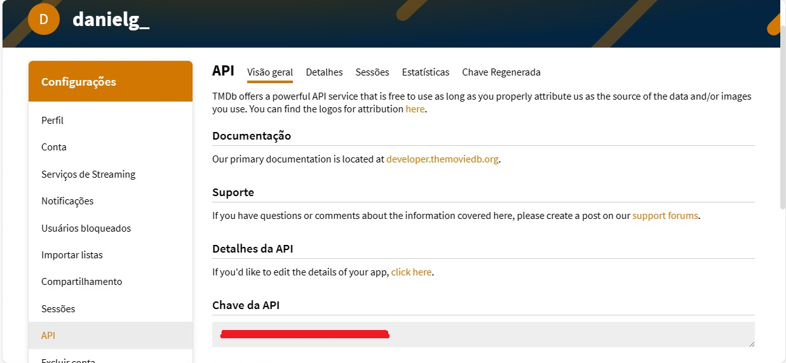
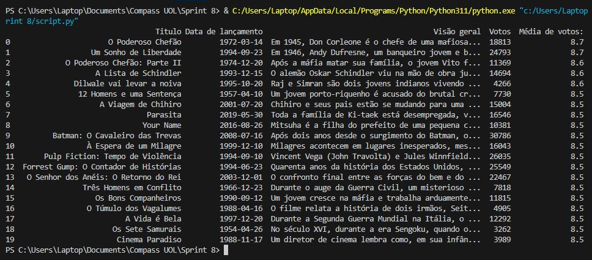

# Sprint 8

## Tarefa 1: Exercício TMDB

### Etapa 1 -  Criando sua conta no TMDB

#### Conta criada


#### API criada



### Etapa 2 - Testando rapidamente as credenciais e a biblioteca

#### Código

``` python
import requests
import pandas as pd

from IPython.display import display

api_key = <API_KEY>

url = f"https://api.themoviedb.org/3/movie/top_rated?api_key={api_key}&language=pt-BR"


response = requests.get(url)
data = response.json()

filmes = []

for movie in data['results']:
    df = {'Titulo': movie['title'], 
          'Data de lançamento': movie['release_date'],
          'Visão geral': movie['overview'],
          'Votos': movie['vote_count'],
          'Média de votos:': movie['vote_average']}

    filmes.append(df)

df = pd.DataFrame(filmes)
display(df)
```

#### Saída

