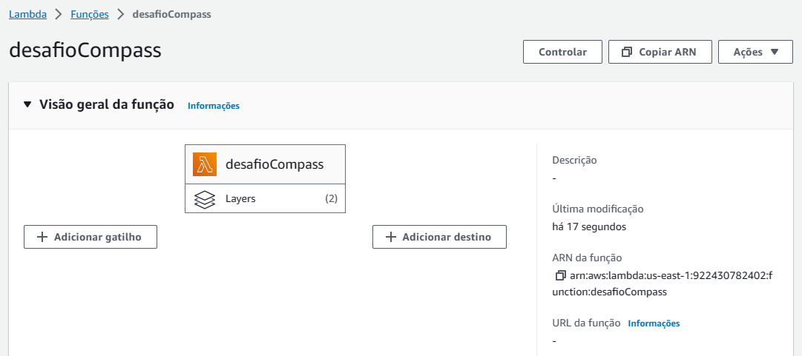
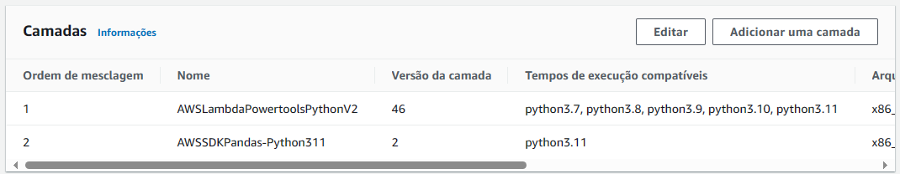
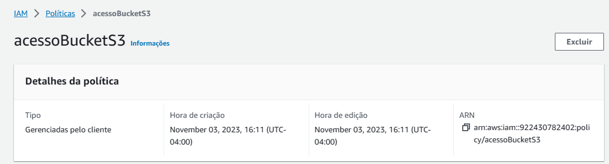
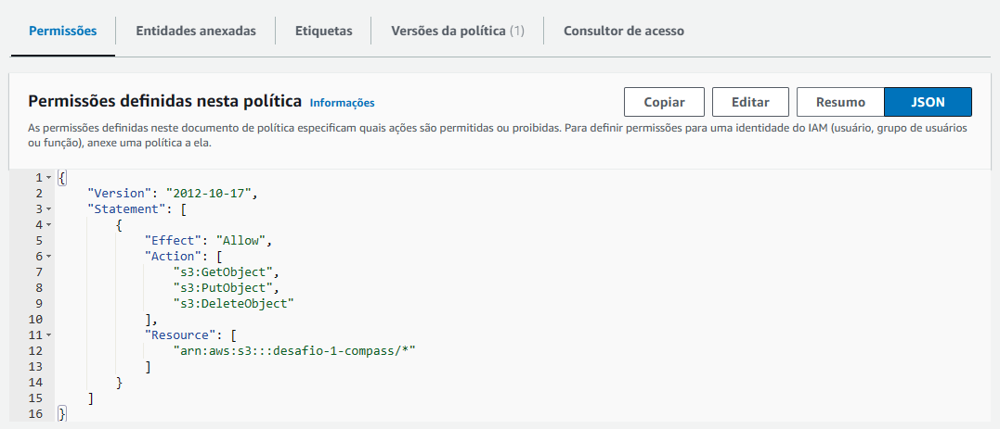
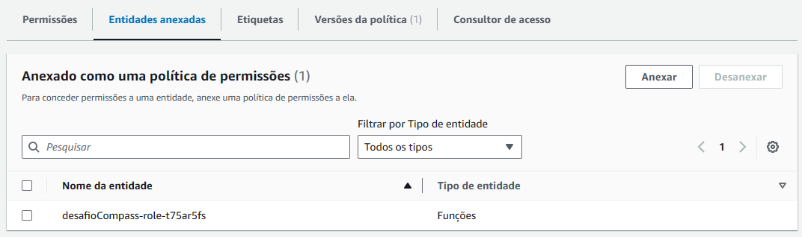
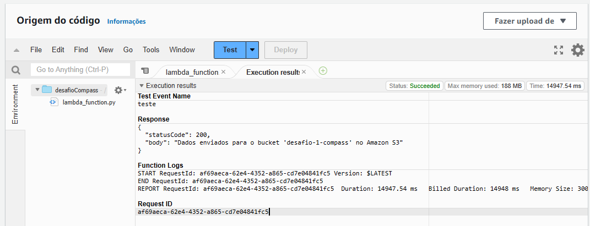
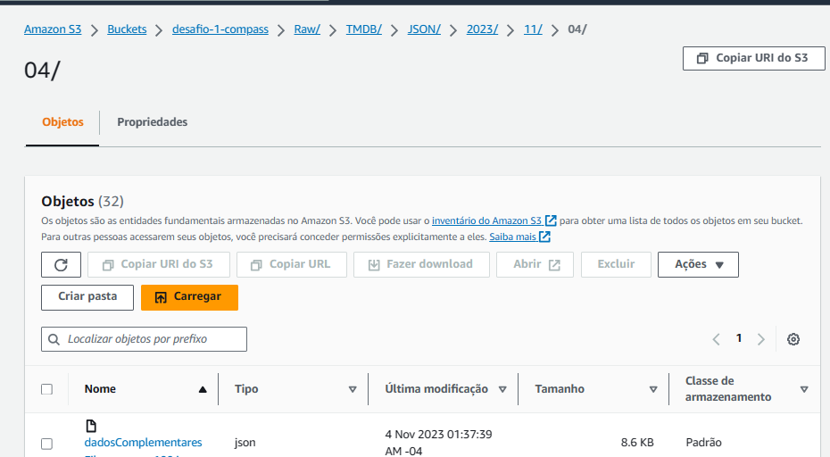
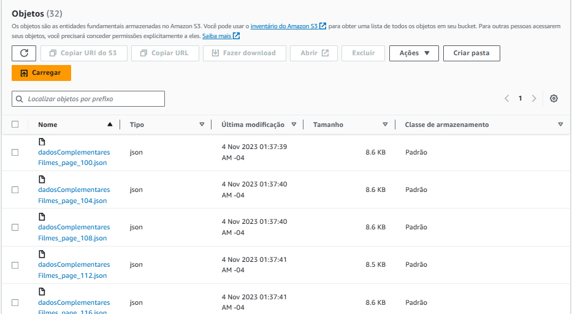
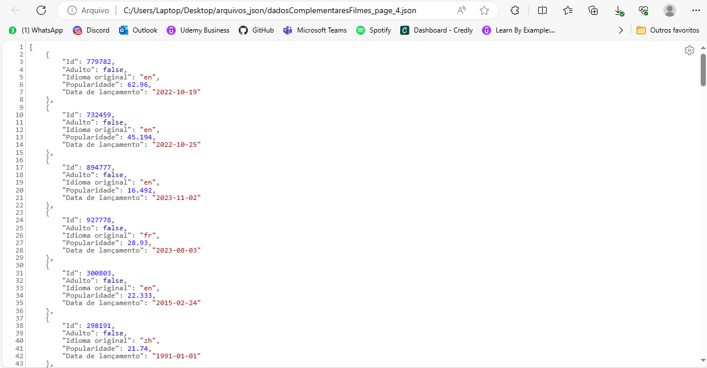

# Sprint 8

## Tarefa 2: Desafio Parte 2 - Ingestão de dados do TMBD

### Função criada



### Camadas



### Política IAM criada
(para conceder permissão para a AWS Lambda ter acesso ao S3)







### Código

``` python
import requests
import boto3
import pandas as pd
from datetime import datetime

def lambda_handler(event, context):
    # Configuração do cliente S3
    s3_client = boto3.client('s3')
    bucket_name = 'desafio-1-compass'

    # Token de autenticação
    api_token = <TOKEN>

    # Configuração para solicitações HTTP
    headers = {
        "accept": "application/json",
        "Authorization": api_token
    }

    # Lista para armazenar os dados dos filmes
    filmes = []

    
    page = 1

    while True:
        
        url = f"https://api.themoviedb.org/3/discover/movie?include_adult=true&include_video=false&language=en-US&page={page}&sort_by=popularity.desc&with_genres=14&without_genres=28%2C12%2C16%2C35%2C80%2C99%2C18%2C10751%2C36%2C27%2C10402%2C9648%2C10749%2C10770%2C53%2C10752%2C37"
        
        
        response = requests.get(url, headers=headers)
        data = response.json()

        # Processar os resultados
        for movie in data.get('results', []):
            release_date = movie.get('release_date', None)
            df = {'Id': movie['id'],
                  'Adulto': movie['adult'],
                  'Idioma original': movie['original_language'],
                  'Popularidade': movie['popularity'],
                  'Data de lançamento': release_date}
            filmes.append(df)

        # Salvar a cada 4 páginas (para não ultrapassar 100 registros por arquivo)
        if page % 4 == 0:
            df = pd.DataFrame(filmes)
            df_body_json = df.to_json(orient='records')

            camada_de_armazenamento = 'Raw'
            origem_do_dado = 'TMDB'
            formato_do_dado = 'JSON'
            data_de_processamento = datetime.now().strftime('%Y/%m/%d')
            caminho_S3 = f'{camada_de_armazenamento}/{origem_do_dado}/{formato_do_dado}/{data_de_processamento}/dadosComplementaresFilmes_page_{page}.json'

            s3_client.put_object(Bucket=bucket_name, Key=caminho_S3, Body=df_body_json)
            filmes = [] 

        # Encerrar o loop se não houver mais resultados
        if not data.get('results'):
            break

        page += 1

    return {
        "statusCode": 200,
        "body": f"Dados enviados para o bucket '{bucket_name}' no Amazon S3"
    }
```



### Arquivos criados







Para consultar os arquivos json, [clique aqui](./arquivos_json/)