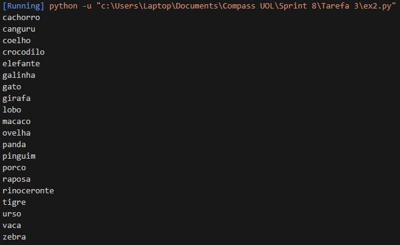
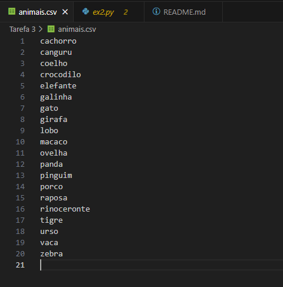

# Sprint 8

## Tarefa 3: Exercícios - Geração de massa de dados

### Exercício 1

#### Código:

``` python
# [Warm up]  Em Python, declare e inicialize uma lista contendo 250 inteiros obtidos de forma aleatória.
# Após, aplicar o método reverse sobre o conteúdo da lista e imprimir o resultado.

import random

lista = [random.randint(1,1000) for x in range(250)]

print(lista)

lista.reverse()

print(lista)
```

#### Saída:


### Exercício 2

#### Código:

``` python
# [Warm up] Em Python, declare e inicialize uma lista contendo o nome de 20 animais.
# Ordene-os em ordem crescente e itere sobre os itens, imprimindo um a um
#(você pode utilizar list comprehension aqui).  Na sequência, armazene o conteúdo da
# lista em um arquivo de texto, um item em cada linha, no formato CSV.

animais = ['cachorro', 'gato', 'coelho', 'porco', 'galinha',
           'vaca', 'ovelha', 'elefante', 'girafa', 'tigre',
           'zebra', 'rinoceronte', 'macaco', 'canguru', 'urso',
           'lobo', 'raposa', 'panda', 'pinguim', 'crocodilo']

animais.sort()

[print(animal) for animal in animais]

with open("animais.csv", "w") as arquivo:
    for animal in animais:
        arquivo.write(animal + "\n")
```
#### Saídas:





### Exercício 3

#### Código

``` python
# [Laboratório] Elaborar um código Python para gerar um dataset de nomes de pessoas.

import random
import time
import os
import names

# Define a semente de aleatoriedade
random.seed(40)
qtd_nomes_unicos = 3000
qtd_nomes_aleatorios = 10000000

# Gerar os nomes aleatórios
aux=[]
for i in range(0, qtd_nomes_unicos):
    aux.append(names.get_full_name())

print("Gerando {} nomes aleatórios".format(qtd_nomes_aleatorios))

dados=[]

for i in range(0,qtd_nomes_aleatorios):
    dados.append(random.choice(aux))

with open("nomes_aleatorios.txt", "w") as arquivo:
    for nome in dados:
        arquivo.write(nome + "\n")
```

#### Saídas:


