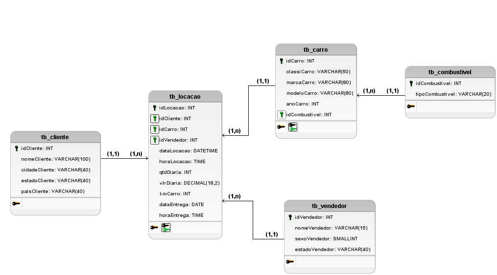

# Sprint 9

## Tarefa 1: Modelagem Relacional - Normalização

### Passos FN

* A tabela tb_locacao já esta em FN1.

* Aplicando a FN2, temos que:

nomeCliente, cidadeCliente, estadoCliente e paisCliente estão associados a locação, mas também a idCliente;
nomeVendedor, sexoVendedor e estadoVendedor estão associados a locação, mas também a idVendedor;
cassiCarro, marcaCarro, modeloCarro, anoCarro, idCombustivel e tipoCombustivel estão associados a locação, mas também a idCarro.

Portanto, criei três novas tabelas: tb_cliente, tb_carro e tb_vendedor, com a chave primária e as colunas correspondentes. Na tabela tb_locacao ficou apenas as chaves estrangeiras referente as novas tabelas.

* Aplicando a FN3 nas tabelas, temos que:

Na tb_carro, tipoCombustivel está em função de idCombustivel. Sendo assim, removi a coluna com o tipo de combustível e armazenei em uma nova tabela tb_combustivel com seu id, mantendo o idCombustivel como chave estrangeira na tb_carro.

### Modelagem Lógica

Montei o seguinte esquema no software BrModelo, para depois me basear nele e montar o script.



### Script

``` sql
-- Criação das tabelas

CREATE TABLE cliente (
	idCliente INT PRIMARY KEY,
	nomeCliente VARCHAR(100),
	cidadeCliente VARCHAR(40),
	estadoCliente VARCHAR(40),
	paisCliente VARCHAR(40)
);

CREATE TABLE vendedor (
	idVendedor INT PRIMARY KEY,
	nomeVendedor VARCHAR(15),
	sexoVendedor SMALLINT,
	estadoVendedor VARCHAR(40)
);

CREATE TABLE combustivel (
	idCombustivel INT PRIMARY KEY,
	tipoCombustivel VARCHAR(20)
);

CREATE TABLE carro (
	idCarro INT PRIMARY KEY,
	classiCarro VARCHAR(50),
	marcaCarro VARCHAR(80),
	modeloCarro VARCHAR(80),
	anoCarro INT,
	idCombustivel INT,
	FOREIGN KEY(idCombustivel) REFERENCES combustivel(idCombustivel)	
);

CREATE TABLE locacao (
	idLocacao INT PRIMARY KEY,
	idCliente INT,
	idCarro INT,
	idVendedor INT,
	dataLocacao DATETIME,
	horaLocacao TIME,
	qtdDiaria INT,
	vlrDiaria DECIMAL(18,2),
  	kmcarro INT,
	dataEntrega DATE,
	horaEntrega TIME,
	FOREIGN KEY(idCliente) REFERENCES cliente(idCliente),
	FOREIGN KEY(idCarro) REFERENCES carro(idCarro),
	FOREIGN KEY(idVendedor) REFERENCES vendedor(idVendedor)
);

-- Inserção dos dados

INSERT INTO cliente (idCliente, nomeCliente, cidadeCliente, estadoCliente, paisCliente)
SELECT DISTINCT idCliente, nomeCliente, cidadeCliente, estadoCliente, paisCliente
FROM tb_locacao


INSERT INTO vendedor (idVendedor, nomeVendedor, sexoVendedor, estadoVendedor)
SELECT DISTINCT idVendedor, nomeVendedor, sexoVendedor, estadoVendedor
FROM tb_locacao

INSERT INTO combustivel (idCombustivel, tipoCombustivel)
SELECT DISTINCT idCombustivel, tipoCombustivel
FROM tb_locacao

INSERT INTO carro (idCarro, classiCarro, marcaCarro, modeloCarro, anoCarro, idCombustivel)
SELECT DISTINCT idCarro, classiCarro, marcaCarro, modeloCarro, anoCarro, idCombustivel
FROM tb_locacao


INSERT INTO locacao (idLocacao, idCliente, idCarro, idVendedor, dataLocacao, horaLocacao,
					qtdDiaria, vlrDiaria, kmcarro, dataEntrega, horaEntrega)
SELECT DISTINCT idLocacao, idCliente, idCarro, idVendedor, dataLocacao, horaLocacao,
				qtdDiaria, vlrDiaria, kmcarro, dataEntrega, horaEntrega
FROM tb_locacao
```

### Modelagem Lógica após a normalização

(gerada no DBeaver)


![modelagem gerada no DBeaver]