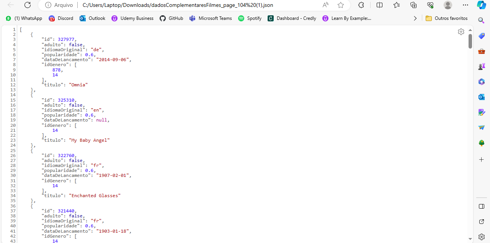
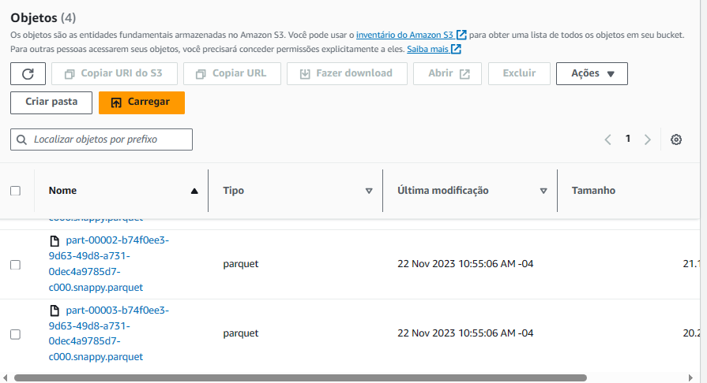
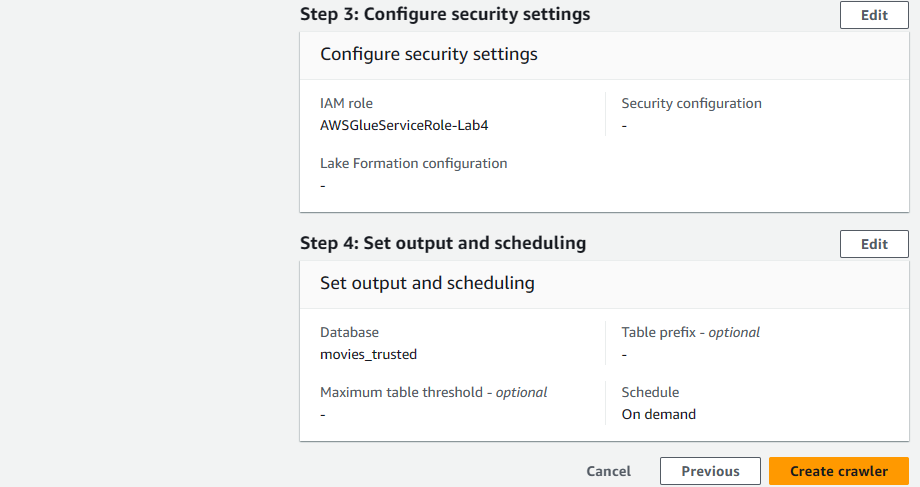
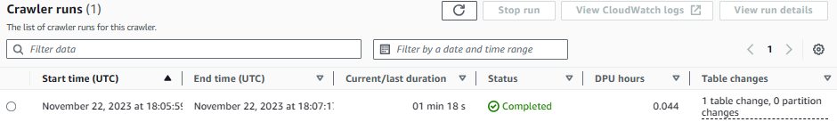
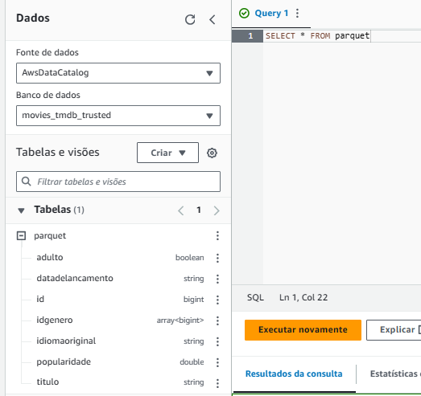

# Sprint 9

## Tarefa 3: Desafio Parte 3 - Processamento da Trusted

### Atualização dados TMDB

Percebi que precisava puxar mais alguns dados da API para conseguir fazer a junção dos dados da API com os do TMDB, pois não haviam dados em comum.
Por isso, fiz uma nova requisição, incluindo os dados 'genre_ids' e 'title', conforme as imagens abaixo evidenciam.

* Alteração no código do Lambda


* Função executada


* Arquivos criados


* Estrutura dos arquivos


### Job para processamento dos arquivos CSV


* Script

``` python
import sys
from awsglue.transforms import *
from awsglue.utils import getResolvedOptions
from pyspark.context import SparkContext
from awsglue.context import GlueContext
from awsglue.job import Job
from pyspark.sql.types import StructType, StructField, StringType, IntegerType, DoubleType

## @params: [JOB_NAME]
args = getResolvedOptions(sys.argv, ['JOB_NAME'])

sc = SparkContext()
glueContext = GlueContext(sc)
spark = glueContext.spark_session
job = Job(glueContext)
job.init(args['JOB_NAME'], args)

schema = StructType([
    StructField("id", StringType(), True),
    StructField("tituloPrincipal", StringType(), True),
    StructField("tituloOriginal", StringType(), True),
    StructField("anoLancamento", IntegerType(), True),
    StructField("tempoMinutos", IntegerType(), True),
    StructField("genero", StringType(), True),
    StructField("notaMedia", DoubleType(), True),
    StructField("numeroVotos", IntegerType(), True),
    StructField("generoArtista", StringType(), True),
    StructField("personagem", StringType(), True),
    StructField("nomeArtista", StringType(), True),
    StructField("anoNascimento", IntegerType(), True),
    StructField("anoFalecimento", IntegerType(), True),
    StructField("profissao", StringType(), True),
    StructField("titulosMaisConhecidos", StringType(), True)
])

movies_csv_raw = 's3://desafio-1-compass/Raw/Local/CSV/Movies/2023/10/25/movies.csv'

raw_data1 = spark.read.csv(movies_csv_raw, header=True, schema=schema, sep="|")
raw_data1.write.mode("overwrite").parquet('s3://desafio-3-compass/Trusted/CSV/Parquet/')

job.commit()
```

* Job details


* Run


* Arquivos no bucket do S3


### Job para processamento dos arquivos JSON


* Script

``` python
import sys
from awsglue.transforms import *
from awsglue.utils import getResolvedOptions
from pyspark.context import SparkContext
from awsglue.context import GlueContext
from awsglue.job import Job

from awsglue.context import DynamicFrame

# @params: [JOB_NAME, S3_INPUT_PATH, S3_TARGET_PATH]
args = getResolvedOptions(sys.argv, ['JOB_NAME'])

sc = SparkContext()
glueContext = GlueContext(sc)
spark = glueContext.spark_session
job = Job(glueContext)
job.init(args['JOB_NAME'], args)

tmdb_s3_path = "s3://desafio-1-compass/Raw/TMDB/JSON/2023/11/21/"

spark_df = spark.read.json(tmdb_s3_path)

spark_df.write.format('parquet').mode("overwrite").save("s3://desafio-3-compass/Trusted/TMDB/Parquet")

job.commit()

```

* Job details


* Run


* Arquivos no bucket do S3





### Criação das Tabelas referentes aos arquivos CSV

* Criação da Crawler

Para a criação das tabelas, resolvi usar as Crawlers, pois eles monitoram nosso armazenamento de dados de
modo a criar e atualizar metadados no Glue de forma automática, logo criam a tabela automaticamente.




**Obs:** Aproveitei a role IAM criada no laboratório AWS Glue (da Sprint 7), pois ela já associa as politícas necessárias (AmazonS3FullAccess, AWSLakeFormationDataAdmin, AWSGlueConsoleFullAccess e
CloudWatchFullAccess), permitindo o acesso do Glue ao S3.

* Crawler Run


* Consulta da tabela no Athena


### Criação das Tabelas referentes aos arquivos JSON


* Crawler


* Crawler Run



* Consulta da tabela no Athena




