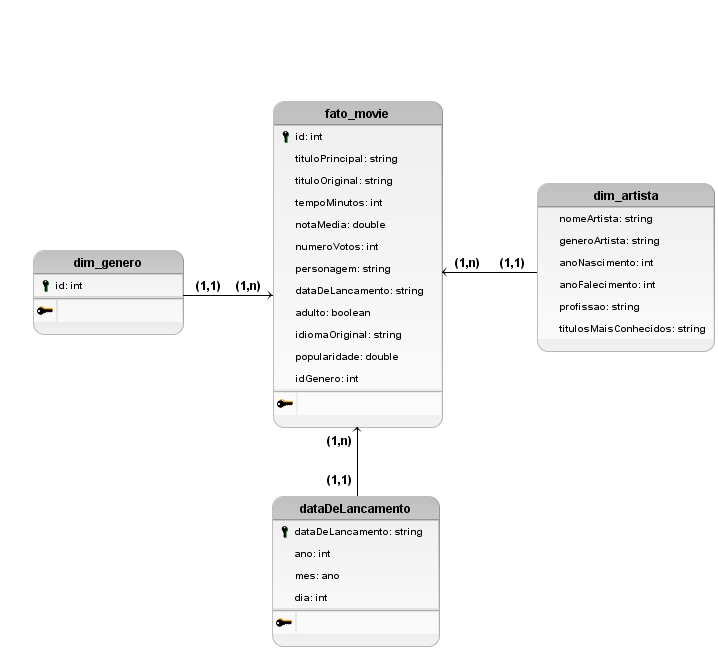

# Sprint 9

## Tarefa 4: Desafio Parte 3 - Modelagem de dados da Refined

Analisando os arquivos parquet originados do CSV e da API TMDB, foram identificados os seguintes campos:

* CSV:

id, tituloprincipal, titulooriginal, anolancamento, tempominutos, genero,
notamedia, numerovotos, generoartista, personagem, nomeartista, anonascimento,
anofalecimento, profissao, titulosmaisconhecidos

* TMDB:

id, adulto, idiomaOriginal, popularidade, dataDeLancamento, idGenero, titulo

---

Baseado nesses campos, identifiquei as dimensões *artista*, *genero* e *data de lançamento*, além do fato *movie*.

Com isso, utilizando o software *BrModelo*, fiz a seguinte modelagem dimensional:

