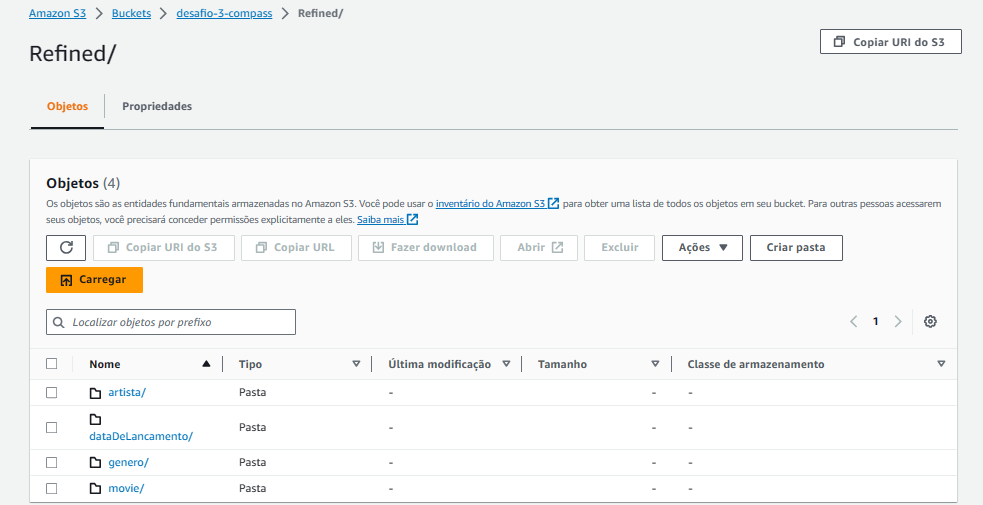
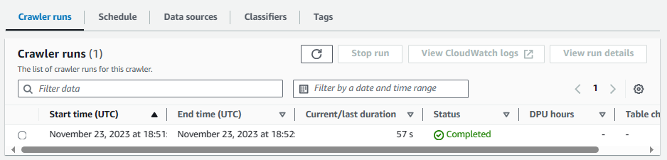

# Sprint 9

## Tarefa 5: Desafio Parte 3 - Processamento da Refined

### Job para processamento da camada Trusted.

Criação do job *camada_refined* para o processamento da camada trusted.

* Job


* Job details


* Código

Para o código, relacionei as colunas referentes aos títulos dos filmes para fazer a junção das tabelas.

Foram criadas views, e a partir delas foram feitos os dataframes, resultando em: 
*artista*, *dataDeLancamento*, *genero*, *movie*.

Enfrentei alguns problemas de ambiguidade por causa de nomes iguais em colunas da mesma tabela ou de tabelas/views distintas. Consegui resolver esse problema renomeando o nome de algumas colunas.

Segue o script criado no Job:

``` python 
import sys
from awsglue.transforms import *
from awsglue.utils import getResolvedOptions
from pyspark.context import SparkContext
from awsglue.context import GlueContext
from awsglue.job import Job
from awsglue.dynamicframe import DynamicFrame
from pyspark.sql.functions import *

##@params: [JOB_NAME]

args = getResolvedOptions(sys.argv, ['JOB_NAME'])

sc = SparkContext()
glueContext = GlueContext(sc)
spark = glueContext.spark_session
job = Job(glueContext)
job.init(args['JOB_NAME'], args)

path_csv = 's3://desafio-3-compass/Trusted/CSV/Parquet/'
path_tmdb = 's3://desafio-3-compass/Trusted/TMDB/Parquet/'

# Lendo os arquivos no S3 como DynamicFrames
df_csv = glueContext.create_dynamic_frame.from_options(
    "s3",
    {
        "paths": [
            path_csv
        ],
        "recurse": True,
    },
    "parquet"
    )

df_tmdb = glueContext.create_dynamic_frame.from_options(
    "s3",
    {
        "paths": [
            path_tmdb
        ],
        "recurse": True,
    },
    "parquet"
    )

# Convertendo DynamicFrames para DataFrames
df_csv = df_csv.toDF()
df_tmdb = df_tmdb.toDF()

# Renomeando coluna para evitar conflito
df_csv = df_csv.withColumnRenamed("id", "id_csv")

# Juntando os dataframes
df = df_csv.join(df_tmdb, df_csv.tituloPrincipal == df_tmdb.titulo, "right")

# Criando views temporárias para consultas SQL

df.createOrReplaceTempView("df")

spark.sql("""
    CREATE OR REPLACE TEMP VIEW dim_genero AS
    SELECT DISTINCT idGenero
    FROM df
""")

spark.sql("""
    CREATE OR REPLACE TEMP VIEW dim_data AS
    SELECT DISTINCT
            dataDeLancamento,
            YEAR(dataDeLancamento) AS ano,
            MONTH(dataDeLancamento) AS mes,
            DAYOFMONTH(dataDeLancamento) AS dia
    FROM df
""")

spark.sql("""
    CREATE OR REPLACE TEMP VIEW dim_artista AS
    SELECT DISTINCT nomeArtista,
        generoArtista,
        anoNascimento,
        anoFalecimento,
        profissao,
        titulosMaisConhecidos
    FROM df
""")

# Criando DataFrames a partir das views temporárias

genero = spark.sql("SELECT DISTINCT idGenero as `id` FROM dim_genero")
dataDeLancamento = spark.sql("""
    SELECT DISTINCT dataDeLancamento, 
        YEAR(dataDeLancamento) AS ano,
        MONTH(dataDeLancamento) AS mes,  
        DAYOFMONTH(dataDeLancamento) AS dia
    FROM dim_data
""")
artista = spark.sql("""
    SELECT DISTINCT nomeArtista,
        generoArtista,
        anoNascimento,
        anoFalecimento,
        profissao,
        titulosMaisConhecidos
    FROM df
""")

movie = spark.sql("""
SELECT DISTINCT id,
    tituloPrincipal,
    tituloOriginal,
    tempoMinutos,
    notaMedia,
    numeroVotos,
    personagem,
    dim_data.dataDeLancamento AS dataDeLancamento,
    adulto,
    idiomaOriginal,
    popularidade,
    dim_genero.idGenero AS idGenero,
    df.nomeArtista
    FROM df
    JOIN dim_data ON dim_data.dataDeLancamento = df.dataDeLancamento
    JOIN dim_genero ON df.idGenero=dim_genero.idGenero
    JOIN dim_artista ON df.nomeArtista=dim_artista.nomeArtista
""")

# Convertendo DataFrames para DynamicFrames
genero = DynamicFrame.fromDF(genero, glueContext, "genero")
dataDeLancamento = DynamicFrame.fromDF(dataDeLancamento, glueContext, "dataDeLancamento")
artista = DynamicFrame.fromDF(artista, glueContext, "artista")
movie = DynamicFrame.fromDF(movie, glueContext, "movie")

# Escrevendo os DynamicFrames de volta para o S3
path_genero = 's3://desafio-3-compass/Refined/genero'
path_dataDeLancamento = 's3://desafio-3-compass/Refined/dataDeLancamento'
path_artista = 's3://desafio-3-compass/Refined/artista'
path_movie = 's3://desafio-3-compass/Refined/movie'

glueContext.write_dynamic_frame.from_options(
    frame = genero,
    connection_type = "s3",
    connection_options = {
        "path": path_genero,
    },
    format = "parquet")

glueContext.write_dynamic_frame.from_options(
    frame = dataDeLancamento,
    connection_type = "s3",
    connection_options = {
        "path": path_dataDeLancamento,
    },
    format = "parquet")

glueContext.write_dynamic_frame.from_options(
    frame = artista,
    connection_type = "s3",
    connection_options = {
        "path": path_artista,
    },
    format = "parquet")

glueContext.write_dynamic_frame.from_options(
    frame = movie,
    connection_type = "s3",
    connection_options = {
        "path": path_movie,
    },
    format = "parquet")

job.commit()
```

* Job run


### Camada Refined criada no S3

A partir do Job criado anteriormente, foram gerados os arquivos parquet no S3, separados em diretórios correspondentes as tabelas.

* Refined



* artista


* dataDeLancamento


* genero


* movie


### Crawler

Criei o crawler *RefinedCrawler* para criar e visualizar as tabelas no Athena.

* Criando crawler


* Crawler criada


* Crawler run



### Tabelas

Consultando as tabelas pelo Athena, obtive os seguintes resultados satisfatórios:

* Artista


* Data de Lançamento


* Gênero


* Movie

